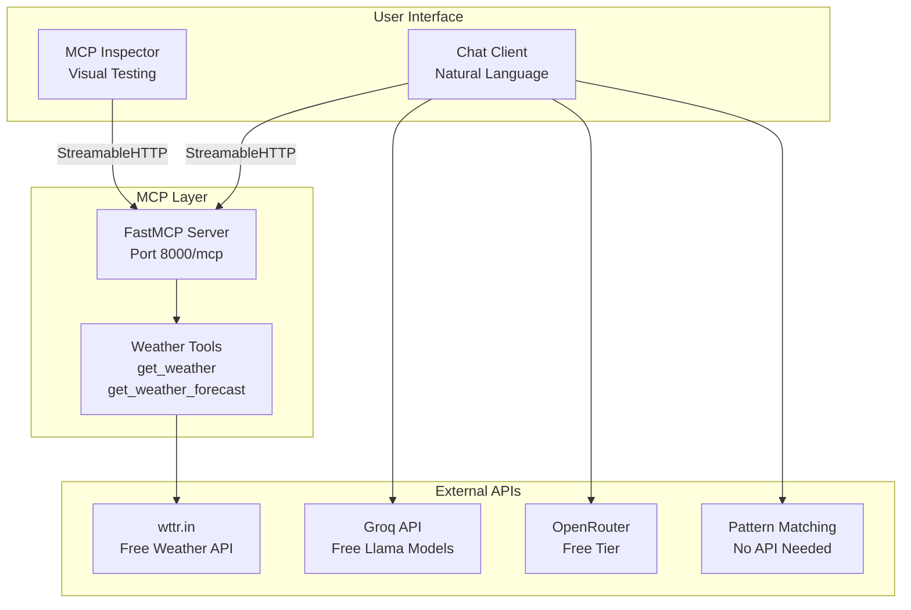

# MCP Weather Demo Workshop

A complete **Model Context Protocol (MCP)** demonstration showing how to build MCP servers and clients from scratch. Perfect for workshops, tutorials, and learning MCP concepts.

## 🎯 What You'll Learn

- **MCP Protocol Fundamentals** - How LLMs communicate with external tools
- **MCP Server Development** - Create tools that LLMs can call
- **MCP Client Development** - Build applications that use MCP tools
- **Real-world Integration** - Weather API + Free LLM integration
- **Modern Transports** - StreamableHTTP for production-ready MCP servers
- **Workshop-Ready** - Zero-friction setup with fallback options

## 🌟 Features

✅ **Zero API Key Required** - Works completely offline with pattern matching  
✅ **Free Weather Data** - Uses wttr.in (no signup needed)  
✅ **Multiple LLM Options** - Groq, OpenRouter, or pattern matching fallback  
✅ **Modern MCP Transport** - StreamableHTTP (latest standard)  
✅ **FastMCP Integration** - Clean, Pythonic MCP development  
✅ **Workshop-Friendly** - Never fails due to API issues  
✅ **Visual Testing** - MCP Inspector integration  

## 📁 Project Structure

```
mcp-demo/
├── README.md                    # This comprehensive guide
├── server.py                    # FastMCP server with weather tools
├── client.py                    # MCP client with multi-LLM support  
├── inspector_config.json        # MCP Inspector configuration
├── pyproject.toml              # Python dependencies
├── .env.example                # Environment variables template
└── .gitignore                  # Git ignore patterns
```

## 🚀 Quick Start (5 Minutes)

### Prerequisites
- **Python 3.13+** ([Download](https://www.python.org/downloads/))
- **uv** package manager ([Install](https://docs.astral.sh/uv/getting-started/installation/))
- **Grok** Grok Api Key
- **Node.js** (optional, for MCP Inspector)

### Step 1: Project Setup
```bash
# Create project directory
mkdir mcp-demo && cd mcp-demo

# Initialize Python project
uv init --python 3.13
```

### Step 2: Install Dependencies
```bash
# Install core dependencies
uv add fastmcp requests python-dotenv

# That's it! Only 3 dependencies needed.
```

### Step 3: Environment Setup (Optional)
```bash
# Copy environment template
cp .env.example .env

# Edit .env with your API keys (optional)
nano .env
```

**Note**: The demo works without any API keys using pattern matching!

### Step 4: Run the Demo

#### Option A: Server + Inspector (Visual Testing)
```bash
# Terminal 1: Start MCP Server
python server.py
# ✅ Server running at http://localhost:8000/mcp

# Terminal 2: Start Inspector
npx @modelcontextprotocol/inspector@latest inspector_config.json
# ✅ Inspector opens in browser
```

#### Option B: Server + Client (Chat Demo)
```bash
# Terminal 1: Start MCP Server  
python server.py

# Terminal 2: Start Chat Client
python client.py
# ✅ Chat interface ready
```

### Step 5: Test It!

**In Inspector:**
- Tool: `get_weather`
- Arguments: `{"city": "London"}`
- ✅ See real weather data!

**In Chat Client:**
```
👤 You: What's the weather in Tokyo?
🤖 Assistant: [Calls weather tool and responds with current weather]
```

## 🏗️ Architecture Overview



## 🛠️ Component Deep Dive

### MCP Server (`server.py`)

The heart of the demo - a FastMCP server that exposes weather tools:

```python
from fastmcp import FastMCP
import requests

mcp = FastMCP("Weather Server")

@mcp.tool()
async def get_weather(city: str) -> dict:
    """Get current weather for a city using free wttr.in API"""
    url = f"https://wttr.in/{city}?format=j1"
    response = requests.get(url, timeout=10)
    # ... process and return weather data
    
# Start server with modern transport
mcp.run(transport="streamable-http", port=8000)
```

**Key Features:**
- **FastMCP Framework** - Minimal boilerplate, just decorate functions
- **StreamableHTTP Transport** - Latest MCP standard (SSE deprecated)
- **Free Weather API** - wttr.in requires no signup or API keys
- **Rich Weather Data** - Temperature, humidity, wind, UV index, forecast
- **Error Handling** - Graceful failures with helpful messages

### MCP Client (`client.py`)

A sophisticated client with multiple LLM fallback options:

```python
from fastmcp import Client

# Multi-tier LLM approach
async with Client("http://localhost:8000/mcp") as client:
    # Get available tools
    tools = await client.list_tools()
    
    # Call LLM with tool access
    response = await call_llm(user_message, tools, client)
```

**Fallback Strategy:**
1. **Groq API** - Fast, free Llama models (with signup)
2. **Pattern Matching** - Regex-based parsing (no API needed)

This ensures the demo **never fails** due to API issues!

### Inspector Integration

Pre-configured for instant visual testing:

```json
{
  "name": "MCP Weather Demo",
  "servers": {
    "weather-server": {
      "url": "http://localhost:8000/mcp"
    }
  }
}
```

Perfect for workshops - attendees can see MCP protocol in action!

## 🌤️ Weather API Details

### Why wttr.in?

- **✅ No Signup Required** - Zero friction for workshops
- **✅ No API Keys** - Works immediately 
- **✅ Rich Data** - Current weather + 3-day forecast
- **✅ Global Coverage** - Works for any city worldwide
- **✅ Reliable** - Well-maintained service
- **✅ JSON Format** - Easy to parse and use

### API Example

```bash
# Test the API directly
curl "https://wttr.in/Jerusalem?format=j1"

# Returns comprehensive JSON with:
# - current_condition: temp, humidity, wind, UV index
# - weather: 3-day forecast with astronomy data
# - nearest_area: location details
```

### Data Structure

```python
{
    "city": "Jerusalem",
    "country": "Israel", 
    "temperature": "22°C (72°F)",
    "feels_like": "24°C (75°F)",
    "description": "Partly cloudy",
    "humidity": "65%",
    "wind_speed": "15 km/h",
    "wind_direction": "NW",
    "visibility": "10 km",
    "uv_index": "6",
    "local_time": "2025-01-15 14:30"
}
```

## 🤖 LLM Integration

### Groq (Recommended)

**Setup:**
1. Visit [console.groq.com](https://console.groq.com)
2. Sign up (free)
3. Get API key
4. Add to `.env`: `GROQ_API_KEY=your_key_here`

**Benefits:**
- ✅ Fast inference (very quick responses)
- ✅ Free tier generous (lots of requests)
- ✅ Reliable Llama-3 models
- ✅ Good tool calling support
- ✅ Works great with MCP

### Pattern Matching Fallback

**How it works:**
```python
# Extracts city from natural language
"What's the weather in London?" → calls get_weather("London")
"How's Tokyo today?" → calls get_weather("Tokyo")
"Weather in Beer Sheva?" → calls get_weather("Beer Sheva")
```

**Benefits:**
- ✅ **No API keys needed**
- ✅ **Perfect for workshops**
- ✅ **Always works**
- ✅ **Still demonstrates MCP**
- ✅ **Zero setup friction**

## 💡 **Why Only Groq?**

After testing, **Groq is the most reliable free option** for workshops:

- **Other Free APIs**: Rate limits or signup friction
- **Groq**: Consistent, fast, generous free tier

**Two-tier approach is simpler:**
1. **Groq** - For full LLM experience
2. **Pattern Matching** - For zero-setup workshops

## 🎓 Workshop Usage

### For Instructors

This demo is designed for teaching MCP concepts with zero setup friction:

**Teaching Flow:**
1. **Start with Inspector** - Visual tool testing
2. **Show Server Code** - How tools are created  
3. **Demo Client** - End-to-end integration
4. **Explain Fallbacks** - Production considerations

**Key Teaching Points:**
- MCP protocol separates tools from LLMs
- Tools are just decorated Python functions
- Transport handles communication details
- Fallbacks ensure reliability

## 📋 Troubleshooting

### Common Issues

**Port 8000 already in use:**
```bash
# Kill existing processes
sudo fuser -k 8000/tcp

# Or use different port
python server.py --port 8001
```

**Import errors:**
```bash
# Reinstall dependencies
uv sync
```

**API timeouts:**
```bash
# Check internet connection
curl https://wttr.in/London?format=j1

# Try different city name
```

### Debug Mode

Enable detailed logging:
```bash
export DEBUG=1
python server.py
```

### Testing Components

**Test weather API directly:**
```bash
python -c "
import requests
r = requests.get('https://wttr.in/London?format=j1')
print(r.json()['current_condition'][0]['temp_C'])
"
```

**Test MCP server:**
```bash
curl http://localhost:8000
# Should return server info
```

## 🚀 Production Deployment

### Docker Deployment

```dockerfile
FROM python:3.13-slim

WORKDIR /app
COPY . .

RUN pip install fastmcp requests python-dotenv
EXPOSE 8000

CMD ["python", "server.py"]
```

```bash
docker build -t mcp-weather .
docker run -p 8000:8000 mcp-weather
```

### Cloud Deployment

**Heroku:**
```bash
git init
heroku create your-mcp-server
git push heroku main
```

**Railway:**
```bash
railway login
railway init
railway deploy
```

### Environment Variables

Production `.env`:
```bash
GROQ_API_KEY=prod_key_here
PORT=8000
HOST=0.0.0.0
DEBUG=false
```

## 📚 Learning Resources

### MCP Documentation
- [Official MCP Specification](https://modelcontextprotocol.io)
- [MCP Python SDK](https://github.com/modelcontextprotocol/python-sdk)
- [FastMCP Documentation](https://github.com/jlowin/fastmcp)

### Related Technologies
- [wttr.in Weather API](https://wttr.in/:help)
- [Groq API Documentation](https://console.groq.com/docs)

### Advanced Topics
- [MCP Security Best Practices](https://modelcontextprotocol.io/security)
- [Production MCP Deployment](https://modelcontextprotocol.io/deployment)
- [Custom MCP Transports](https://modelcontextprotocol.io/transports)

## 🤝 Contributing

Contributions welcome! Areas for improvement:

- **New Tools** - Add more weather tools (alerts, historical data)
- **LLM Integrations** - Support for more free LLM providers  
- **UI Improvements** - Better chat interface
- **Documentation** - More workshop materials
- **Testing** - Automated test suite
- **Examples** - More MCP use cases

### Development Setup

```bash
git clone https://github.com/omryatia/mcp-demo
cd mcp-demo
uv sync --dev
pre-commit install
```

### Running Tests

```bash
uv run pytest
uv run mypy .
uv run ruff check .
```

## 📝 License

MIT License - see [LICENSE](LICENSE) file for details.

## 🙏 Acknowledgments

- **Anthropic** - For creating the MCP specification
- **FastMCP** - For the excellent Python framework  
- **wttr.in** - For providing free weather data
- **Groq** - For fast, free LLM inference
- **Community** - For feedback and contributions

## 📬 Support

- **Issues**: [GitHub Issues](https://github.com/omryatia/mcp-demo/issues)
- **Discussions**: [GitHub Discussions](https://github.com/omryatia/mcp-demo/discussions)  

---

**Built with ❤️ for the MCP community**

*Perfect for workshops, tutorials, and learning MCP development!* 🎉