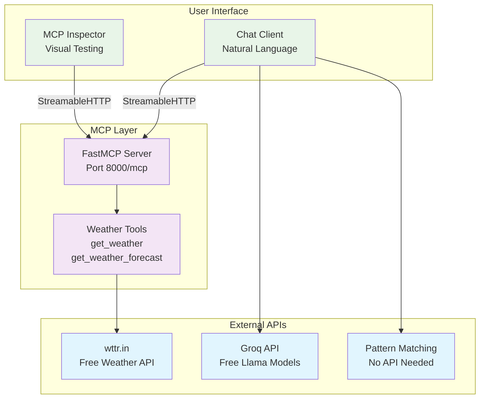

# MCP Weather Demo Workshop

A complete **Model Context Protocol (MCP)** demonstration showing how to build MCP servers and clients from scratch. Perfect for workshops, tutorials, and learning MCP concepts.

## 🎯 What You'll Learn

- **MCP Protocol Fundamentals** - How LLMs communicate with external tools
- **MCP Server Development** - Create tools that LLMs can call
- **MCP Client Development** - Build applications that use MCP tools
- **Real-world Integration** - Weather API + Free LLM integration
- **Modern Transports** - StreamableHTTP for production-ready MCP servers
- **Workshop-Ready** - Zero-friction setup with fallback options

## 🌟 Features

✅ **Zero API Key Required** - Works completely offline with pattern matching  
✅ **Free Weather Data** - Uses wttr.in (no signup needed)  
✅ **Multiple LLM Options** - Groq, or pattern matching fallback  
✅ **Modern MCP Transport** - StreamableHTTP (latest standard)  
✅ **FastMCP Integration** - Clean, Pythonic MCP development  
✅ **Workshop-Friendly** - Never fails due to API issues  
✅ **Visual Testing** - MCP Inspector integration  

## 📁 Project Structure

```
mcp-demo/
├── README.md                    # This comprehensive guide
├── server.py                    # FastMCP server with weather tools
├── client.py                    # MCP client with multi-LLM support  
├── inspector_config.json        # MCP Inspector configuration
├── pyproject.toml              # Python dependencies
├── .env.example                # Environment variables template
└── .gitignore                  # Git ignore patterns
```

## 🚀 Quick Start (5 Minutes)

### Prerequisites
- **Python 3.13+** ([Download](https://www.python.org/downloads/))
- **uv** package manager ([Install](https://docs.astral.sh/uv/getting-started/installation/))
- **Node.js** (optional, for MCP Inspector)

### Step 1: Project Setup
```bash
# Clone the Repo
git clone https://github.com/omryatia/mcp-demo.git

# Create project directory
mkdir mcp-demo && cd mcp-demo

# Initialize Python project
uv init --python 3.13
```

### Step 2: Install Dependencies
```bash
# Install core dependencies
uv add fastmcp requests python-dotenv

# That's it! Only 3 dependencies needed.
```

### Step 3: Environment Setup (Optional but Recommended)
```bash
# Copy environment template
cp .env.example .env

# Edit .env with your API keys
nano .env
```

### Step 4: Get Groq API Key (For Smart Responses)

**Sign up for free Groq API:**

1. **Visit Groq Console**: Go to [console.groq.com](https://console.groq.com)

2. **Create Account**:
   - Click "Sign Up"
   - Use Google/GitHub or email signup
   - **Completely free** - no credit card required

3. **Get API Key**:
   - After signup, go to "API Keys" section
   - Click "Create API Key"
   - Copy the key (starts with `gsk_...`)

4. **Add to Environment**:
   ```bash
   # Edit .env file
   nano .env
   
   # Add your key:
   GROQ_API_KEY=gsk_your_actual_key_here
   ```

**Note**: Demo works without API key using pattern matching, but Groq gives much smarter responses!

### Step 5: Run the Demo

#### Option A: Server + Inspector (Visual Testing)
```bash
# Terminal 1: Start MCP Server
python server.py
# ✅ Server running at http://localhost:8000/mcp

# Terminal 2: Start Inspector
npx @modelcontextprotocol/inspector@latest inspector_config.json
# ✅ Inspector opens in browser
```

#### Option B: Server + Client (Chat Demo)
```bash
# Terminal 1: Start MCP Server  
python server.py

# Terminal 2: Start Chat Client
python client.py
# ✅ Chat interface ready
```

### Step 6: Test It!

**In Inspector:**
- Tool: `get_weather`
- Arguments: `{"city": "London"}`
- ✅ See real weather data!

**In Chat Client:**
```
👤 You: What's the weather in Tokyo?
🤖 Assistant: [Calls weather tool and responds with current weather]
```

## 🏗️ Architecture Overview



## 🛠️ Component Deep Dive

### MCP Server (`server.py`)

The heart of the demo - a FastMCP server that exposes weather tools:

```python
from fastmcp import FastMCP
import requests

mcp = FastMCP("Weather Server")

@mcp.tool()
async def get_weather(city: str) -> dict:
    """Get current weather for a city using free wttr.in API"""
    url = f"https://wttr.in/{city}?format=j1"
    response = requests.get(url, timeout=10)
    # ... process and return weather data
    
# Start server with modern transport
mcp.run(transport="streamable-http", port=8000)
```

**Key Features:**
- **FastMCP Framework** - Minimal boilerplate, just decorate functions
- **StreamableHTTP Transport** - Latest MCP standard (SSE deprecated)
- **Free Weather API** - wttr.in requires no signup or API keys
- **Rich Weather Data** - Temperature, humidity, wind, UV index, forecast
- **Error Handling** - Graceful failures with helpful messages

### MCP Client (`client.py`)

A sophisticated client with multiple LLM fallback options:

```python
from fastmcp import Client

# Multi-tier LLM approach
async with Client("http://localhost:8000/mcp") as client:
    # Get available tools
    tools = await client.list_tools()
    
    # Call LLM with tool access
    response = await call_llm(user_message, tools, client)
```

**Fallback Strategy:**
1. **Groq API** - Fast, free Llama models (with signup)
2. **Pattern Matching** - Regex-based parsing (no API needed)

This ensures the demo **never fails** due to API issues!

### Inspector Integration

Pre-configured for instant visual testing:

```json
{
  "name": "MCP Weather Demo",
  "servers": {
    "weather-server": {
      "url": "http://localhost:8000/mcp"
    }
  }
}
```

Perfect for workshops - attendees can see MCP protocol in action!

## 🌤️ Weather API Details

### Why wttr.in?

- **✅ No Signup Required** - Zero friction for workshops
- **✅ No API Keys** - Works immediately 
- **✅ Rich Data** - Current weather + 3-day forecast
- **✅ Global Coverage** - Works for any city worldwide
- **✅ Reliable** - Well-maintained service
- **✅ JSON Format** - Easy to parse and use

### API Example

```bash
# Test the API directly
curl "https://wttr.in/Jerusalem?format=j1"

# Returns comprehensive JSON with:
# - current_condition: temp, humidity, wind, UV index
# - weather: 3-day forecast with astronomy data
# - nearest_area: location details
```

### Data Structure

```python
{
    "city": "Jerusalem",
    "country": "Israel", 
    "temperature": "22°C (72°F)",
    "feels_like": "24°C (75°F)",
    "description": "Partly cloudy",
    "humidity": "65%",
    "wind_speed": "15 km/h",
    "wind_direction": "NW",
    "visibility": "10 km",
    "uv_index": "6",
    "local_time": "2025-01-15 14:30"
}
```

## 🤖 LLM Integration

### Groq (Recommended for Smart Responses)

**Why Groq?**
- ✅ **Completely free** with generous limits
- ✅ **Fast inference** - Quick responses perfect for demos
- ✅ **Reliable** - Best free LLM API for workshops
- ✅ **Great tool calling** - Excellent MCP integration
- ✅ **No credit card** required for signup

**Setup Steps:**

1. **Visit**: [console.groq.com](https://console.groq.com)
2. **Sign Up**: Free account (Google/GitHub/Email)
3. **Get API Key**: Create API Key → Copy key (starts with `gsk_`)
4. **Add to `.env`**: `GROQ_API_KEY=gsk_your_key_here`

**Models Available:**
- `llama3-8b-8192` - Fast, good for most tasks
- `llama3-70b-8192` - Slower but more capable
- `mixtral-8x7b-32768` - Great for reasoning

### Pattern Matching Fallback (No Setup Required)

**How it works:**
```python
# Extracts city from natural language using regex
"What's the weather in London?" → calls get_weather("London")
"How's Tokyo today?" → calls get_weather("Tokyo")
"Weather in Beer Sheva?" → calls get_weather("Beer Sheva")
```

**Benefits:**
- ✅ **No API keys needed**
- ✅ **Perfect for workshops** - Zero setup friction
- ✅ **Always works** - Never fails due to API issues
- ✅ **Still demonstrates MCP** - Shows tool calling concepts
- ✅ **Educational** - Shows regex parsing vs LLM understanding

### Comparison: Groq vs Pattern Matching

| Feature | Groq LLM | Pattern Matching |
|---------|----------|------------------|
| Setup | Free signup required | Zero setup |
| Intelligence | Natural language understanding | Regex patterns only |
| Flexibility | Handles variations, context, typos | Fixed patterns |
| Responses | Natural, conversational | Template-based |
| Workshop Use | Best experience | Fallback option |

**Recommendation**: Get Groq API key for best demo experience, but pattern matching ensures workshop never fails!

## 🔧 MCP Decorators & Capabilities

FastMCP provides several decorators to expose different types of capabilities to LLMs and MCP clients:

### **@mcp.tool() - Function Calling**

The most common decorator - exposes functions as tools that LLMs can call:

```python
from fastmcp import FastMCP

mcp = FastMCP("Demo Server")

@mcp.tool()
async def get_weather(city: str) -> dict:
    """
    Get current weather for a city
    
    Args:
        city: Name of the city to get weather for
    
    Returns:
        Weather information including temperature, description, etc.
    """
    # Tool implementation
    return {"city": city, "temperature": "22°C"}

@mcp.tool()
async def calculate(expression: str) -> dict:
    """Calculate mathematical expressions"""
    try:
        result = eval(expression)  # Don't do this in production!
        return {"expression": expression, "result": result}
    except Exception as e:
        return {"error": str(e)}
```

### **@mcp.prompt() - Template Prompts**

Provide reusable prompt templates that LLMs can use:

```python
@mcp.prompt()
async def weather_report_prompt(city: str, style: str = "casual") -> str:
    """
    Generate a weather report prompt template
    
    Args:
        city: City name for weather report
        style: Report style (casual, formal, technical)
    """
    styles = {
        "casual": f"Hey! What's the weather like in {city} today?",
        "formal": f"Please provide a formal weather report for {city}.",
        "technical": f"Generate detailed meteorological data for {city}."
    }
    return styles.get(style, styles["casual"])

@mcp.prompt()
async def code_review_prompt(language: str, code: str) -> str:
    """Code review prompt template"""
    return f"""
    Please review this {language} code for:
    - Best practices
    - Potential bugs
    - Performance improvements
    - Security issues
    
    Code:
    ```{language}
    {code}
    ```
    """
```

### **@mcp.resource() - Data Resources**

Expose data sources that LLMs can read from:

```python
@mcp.resource()
async def weather_data(city: str) -> str:
    """
    Provide weather data as a resource
    
    Args:
        city: City name
    """
    # Return structured data as string
    return f"""
    # Weather Data for {city}
    
    Current Conditions:
    - Temperature: 22°C
    - Humidity: 65%
    - Wind: 15 km/h NW
    
    Last Updated: 2025-01-15 14:30 UTC
    """

@mcp.resource()
async def api_documentation() -> str:
    """API documentation resource"""
    return """
    # Weather API Documentation
    
    ## Endpoints
    
    ### GET /weather
    Get current weather for a city
    
    Parameters:
    - city (string): City name
    - units (string): Temperature units (metric, imperial)
    
    Example Response:
    {
        "city": "London",
        "temperature": 15,
        "description": "Cloudy"
    }
    """

@mcp.resource()
async def system_logs() -> str:
    """System logs resource"""
    import datetime
    return f"""
    # System Logs - {datetime.datetime.now()}
    
    [INFO] Weather API requests: 1,245
    [INFO] Cache hit rate: 87%
    [WARN] Rate limit approaching for API key
    [INFO] Server uptime: 2d 14h 32m
    """
```

### **Complete MCP Server Example**

Here's how to use all decorators together:

```python
from fastmcp import FastMCP
import requests
import json

mcp = FastMCP("Comprehensive Weather Server")

# TOOLS - Functions LLMs can call
@mcp.tool()
async def get_weather(city: str, units: str = "metric") -> dict:
    """Get current weather for a city"""
    # Implementation here
    return {"city": city, "temperature": "22°C"}

@mcp.tool()
async def get_alerts(city: str) -> dict:
    """Get weather alerts for a city"""
    return {"city": city, "alerts": ["High wind warning"]}

# PROMPTS - Template prompts LLMs can use
@mcp.prompt()
async def weather_summary_prompt(city: str, include_forecast: bool = False) -> str:
    """Generate weather summary prompt"""
    base = f"Summarize the current weather conditions in {city}"
    if include_forecast:
        base += " and include a brief forecast"
    return base + ". Be concise and helpful."

@mcp.prompt()
async def travel_weather_prompt(cities: list, travel_date: str) -> str:
    """Travel weather planning prompt"""
    cities_str = ", ".join(cities)
    return f"""
    I'm planning to travel to {cities_str} on {travel_date}.
    Please provide weather information for each city and travel recommendations.
    Consider what to pack and best activities for the weather conditions.
    """

# RESOURCES - Data sources LLMs can read
@mcp.resource()
async def weather_history(city: str, days: int = 7) -> str:
    """Historical weather data resource"""
    return f"""
    # Weather History for {city} (Last {days} days)
    
    Day 1: 20°C, Sunny
    Day 2: 18°C, Cloudy  
    Day 3: 22°C, Partly Cloudy
    Day 4: 19°C, Rain
    Day 5: 21°C, Sunny
    Day 6: 23°C, Sunny
    Day 7: 20°C, Overcast
    
    Average Temperature: 20.4°C
    Rainy Days: 1
    """

@mcp.resource()
async def api_status() -> str:
    """API status and health information"""
    return """
    # Weather API Status
    
    ## Service Health
    - API Status: ✅ Operational
    - Response Time: 245ms avg
    - Uptime: 99.9%
    
    ## Rate Limits
    - Requests/minute: 60
    - Requests/day: 1000
    - Current usage: 45%
    
    ## Data Sources
    - wttr.in: ✅ Available
    - Backup APIs: ✅ Ready
    """

# Run the server
if __name__ == "__main__":
    mcp.run(transport="streamable-http", port=8000)
```

### **How Each Type Works with LLMs**

#### **Tools (@mcp.tool)**
```
User: "What's the weather in Paris?"
LLM: Calls get_weather(city="Paris")
Result: {"city": "Paris", "temperature": "18°C", "description": "Rainy"}
LLM: "The weather in Paris is currently 18°C and rainy."
```

#### **Prompts (@mcp.prompt)**
```
User: "Help me write a weather report"
LLM: Uses weather_summary_prompt(city="London")
Prompt: "Summarize the current weather conditions in London. Be concise and helpful."
LLM: Uses this prompt to structure its response
```

#### **Resources (@mcp.resource)**
```
User: "What's the weather trend this week?"
LLM: Reads weather_history(city="London", days=7)
Data: Historical weather information
LLM: Analyzes the data and provides trend analysis
```

### **When to Use Each Type**

| Type | Use Case | Example |
|------|----------|---------|
| **Tools** | Actions, calculations, API calls | get_weather, send_email, query_database |
| **Prompts** | Template generation, structured requests | code_review_prompt, essay_outline |
| **Resources** | Data sources, documentation, logs | api_docs, user_manual, system_status |

### **Benefits of Multiple Types**

1. **Tools**: Execute actions and get real-time data
2. **Prompts**: Provide structured templates for complex tasks  
3. **Resources**: Give LLMs access to reference material
4. **Combined**: Create comprehensive AI assistants with actions + knowledge

This makes MCP servers incredibly powerful - they can provide **tools for actions**, **prompts for guidance**, and **resources for knowledge**! 🚀

## 📋 Troubleshooting

### Common Issues

**Port 8000 already in use:**
```bash
# Kill existing processes
sudo fuser -k 8000/tcp

# Or use different port
python server.py --port 8001
```

**Import errors:**
```bash
# Reinstall dependencies
uv sync
```

**API timeouts:**
```bash
# Check internet connection
curl https://wttr.in/London?format=j1

# Try different city name
```

### Debug Mode

Enable detailed logging:
```bash
export DEBUG=1
python server.py
```

### Testing Components

**Test weather API directly:**
```bash
python -c "
import requests
r = requests.get('https://wttr.in/London?format=j1')
print(r.json()['current_condition'][0]['temp_C'])
"
```

**Test MCP server:**
```bash
curl http://localhost:8000
# Should return server info
```

## 🚀 Production Deployment

### Docker Deployment

```dockerfile
FROM python:3.13-slim

WORKDIR /app
COPY . .

RUN pip install fastmcp requests python-dotenv
EXPOSE 8000

CMD ["python", "server.py"]
```

```bash
docker build -t mcp-weather .
docker run -p 8000:8000 mcp-weather
```

### Cloud Deployment

**Heroku:**
```bash
git init
heroku create your-mcp-server
git push heroku main
```

**Railway:**
```bash
railway login
railway init
railway deploy
```

### Environment Variables

Production `.env`:
```bash
GROQ_API_KEY=prod_key_here
PORT=8000
HOST=0.0.0.0
DEBUG=false
```

## 📚 Learning Resources

### MCP Documentation
- [Official MCP Specification](https://modelcontextprotocol.io)
- [MCP Python SDK](https://github.com/modelcontextprotocol/python-sdk)
- [FastMCP Documentation](https://github.com/jlowin/fastmcp)

### Related Technologies
- [wttr.in Weather API](https://wttr.in/:help)
- [Groq API Documentation](https://console.groq.com/docs)

### Advanced Topics
- [MCP Security Best Practices](https://modelcontextprotocol.io/security)
- [Production MCP Deployment](https://modelcontextprotocol.io/deployment)
- [Custom MCP Transports](https://modelcontextprotocol.io/transports)

## 🤝 Contributing

Contributions welcome! Areas for improvement:

- **New Tools** - Add more weather tools (alerts, historical data)
- **LLM Integrations** - Support for other free LLM providers  
- **UI Improvements** - Better chat interface
- **Documentation** - More workshop materials
- **Testing** - Automated test suite
- **Examples** - More MCP use cases with different decorators

### Development Setup

```bash
git clone https://github.com/omryatia/mcp-demo
cd mcp-demo
uv sync --dev
pre-commit install
```

### Running Tests

```bash
uv run pytest
uv run mypy .
uv run ruff check .
```

## 📝 License

MIT License - see [LICENSE](LICENSE) file for details.

## 🙏 Acknowledgments

- **Anthropic** - For creating the MCP specification
- **FastMCP** - For the excellent Python framework  
- **wttr.in** - For providing free weather data
- **Groq** - For fast, free LLM inference
- **Community** - For feedback and contributions

## 📬 Support

- **Issues**: [GitHub Issues](https://github.com/omryatia/mcp-demo/issues)
- **Discussions**: [GitHub Discussions](https://github.com/omryatia/mcp-demo/discussions)  

---

**Built with ❤️ for the MCP community**

*Perfect for workshops, tutorials, and learning MCP development!* 🎉
